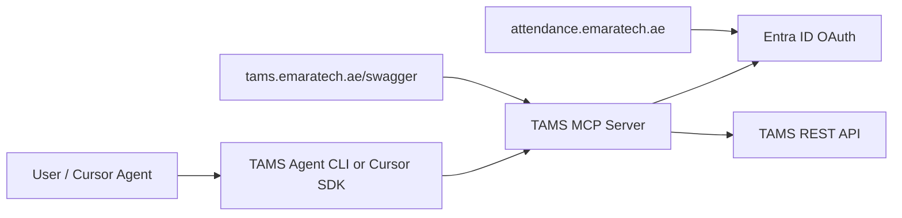

# TAMS Attendance AI Agent

Independent agentic application for querying emaratech TAMS attendance data through an MCP server.

## Architecture



| Component | URL / Role |
|-----------|------------|
| Attendance portal | `https://attendance.emaratech.ae` — browser UI, Entra ID SSO |
| TAMS API + Swagger | `https://tams.emaratech.ae/swagger/index.html` — REST backend |
| MCP server | Wraps TAMS API as MCP tools for AI agents |
| Agent CLI | Natural-language queries via LLM + MCP tools |

## Prerequisites

- Python 3.11+
- Access to `tams.emaratech.ae` (corporate network / VPN)
- Azure Entra ID app registration with API permissions for TAMS
- OpenAI or Anthropic API key (for the standalone agent CLI)

## Quick start

### 1. Swagger spec

The project uses `/home/mayil/attedance/swagger.json` (Connect_API export).

See [docs/CONNECT_API.md](docs/CONNECT_API.md) for endpoint analysis.

```bash
python scripts/generate-tools.py
cd mcp-server && .venv/bin/tams-mcp --list-tools
```

### 2. Configure environment

```bash
cp .env.example .env
# Edit .env with Entra ID and API settings
```

### 3. Install MCP server

```bash
cd mcp-server
python -m venv .venv
source .venv/bin/activate
pip install -e .
```

### 4. Register in Cursor

Add to `~/.cursor/mcp.json` (see `cursor-mcp.example.json`):

```json
{
  "mcpServers": {
    "tams-attendance": {
      "command": "/home/mayil/attedance/mcp-server/.venv/bin/tams-mcp",
      "env": {
        "TAMS_BASE_URL": "https://tams.emaratech.ae",
        "AZURE_TENANT_ID": "...",
        "AZURE_CLIENT_ID": "...",
        "AZURE_CLIENT_SECRET": "...",
        "TAMS_API_SCOPE": "api://<tams-app-id>/.default"
      }
    }
  }
}
```

### 5. Run standalone agent

```bash
cd agent
python -m venv .venv && source .venv/bin/activate
pip install -e .
tams-agent "Show my attendance for last week"
```

### 6. Run with Docker

```bash
docker compose build
docker compose run --rm mcp --list-tools
docker compose --profile agent run --rm agent "Show my attendance for last week"
```

See [docs/DOCKER.md](docs/DOCKER.md) for Cursor MCP docker config and VPN notes.

## Authentication

The attendance portal uses Entra ID SSO. The MCP server supports:

| Mode | Use case | Env vars |
|------|----------|----------|
| `client_credentials` | Service / unattended agent | `AZURE_CLIENT_SECRET` |
| `device_code` | Interactive dev / first login | No secret; browser login |
| `bearer_token` | Token from portal session | `TAMS_ACCESS_TOKEN` |

Set `TAMS_AUTH_MODE` in `.env`.

## Tool generation

Tools are built two ways:

1. **Curated tools** — common attendance queries (`get_attendance_report`, `get_employee_details`, etc.)
2. **Swagger-generated tools** — auto-created from `specs/swagger.json` via `./scripts/generate-tools.py`

After updating swagger, restart the MCP server.

## Project layout

```
mcp-server/     MCP server (stdio) exposing TAMS as tools
agent/          Standalone LLM agent that calls the MCP server
specs/          OpenAPI / swagger specs
scripts/        Swagger fetch and tool generation
```

## Validation checklist

- [ ] `curl -I https://tams.emaratech.ae/swagger/index.html` returns 200 on VPN
- [ ] Entra app has correct API scope for TAMS
- [ ] `tams-mcp --list-tools` lists expected tools
- [ ] Cursor MCP panel shows green connection
- [ ] Agent CLI returns attendance data for a test query

## Remaining setup (requires your environment)

1. Paste or fetch the real `swagger.json` — DNS for `*.emaratech.ae` is not reachable from public internet
2. Confirm TAMS API scope with your Azure admin (`api://.../.default` or custom scope)
3. Map Entra user identity to TAMS `employeeId` if the API requires it
